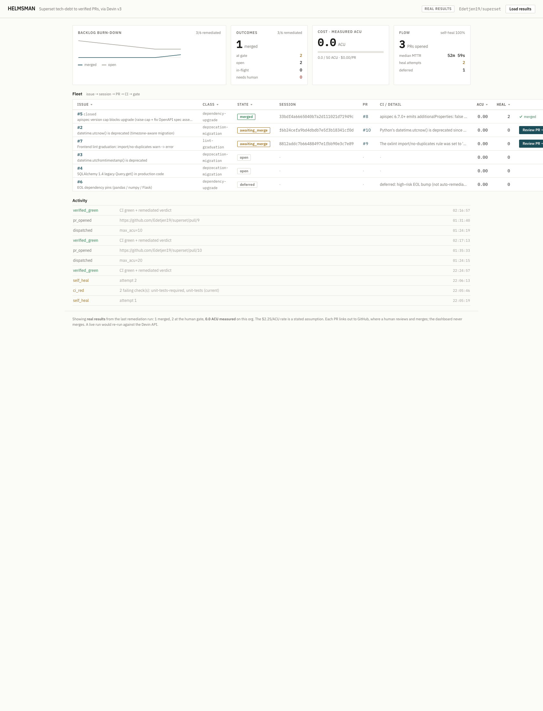
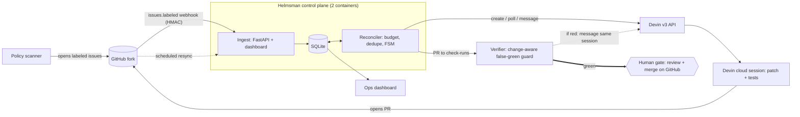

# Helmsman, a Devin × Superset Autonomous Remediation Control Plane

An event-driven control plane that turns a backlog of real Apache Superset tech-debt issues
into **verified pull requests**, using the **Devin v3 API** as the worker primitive. A scanner
opens labeled GitHub issues on the fork; the reconciler dispatches Devin sessions, watches the
fork's **real CI**, can self-heal a red PR by messaging the same session, and reports it on an ops
dashboard with a **human approval gate** instead of auto-merge.

## Start here

**Three real, green pull requests on the fork, one per remediation class, parked at the human gate:**

| PR | Class | What an agent did that a script can't |
|----|-------|----------------------------------------|
| [#8 apispec](https://github.com/Edetjen19/superset/pull/8) | dependency-upgrade | A `sed` bumps the version cap; only an agent recompiled and then found and fixed **5 OpenAPI spec assertions across 5 test files** that the bump broke. |
| [#10 datetime ×27](https://github.com/Edetjen19/superset/pull/10) | deprecation-migration | Migrated 27 `datetime.utcnow()` sites to `datetime.now(tz=timezone.utc).replace(tzinfo=None)`, **preserving naive semantics per site** (a blind aware-swap would raise on naive DB comparisons). |
| [#9 FE-lint](https://github.com/Edetjen19/superset/pull/9) | lint-graduation | Graduated oxlint `import/no-duplicates` warn→error and applied dedup fixes across 32 frontend files. |

The labeled backlog the scanner opened: [`label:devin-remediate`](https://github.com/Edetjen19/superset/issues?q=label%3Adevin-remediate) (#2–#7).

**See the ops board in 60 seconds (no API keys, no network, no ACU):**
```bash
cp .env.example .env              # required: docker compose reads env_file: .env
docker compose up                 # web (ingest + dashboard) + worker (reconciler)
open http://localhost:8000        # the board shows the REAL last-run results; each PR has a "Review PR →" link to GitHub
```

> **What is real vs. SIMULATE.** The dashboard shows **real results from the last remediation run**,
> loaded from a committed, secrets-free snapshot (`data/real_results.json`): **#8 merged**
> (closing issue #5) and #10/#9 at the human gate, with their real CI and Devin sessions; #3/#4
> still **open**; #6 **deferred** (a deliberate policy choice on the high-risk EOL bump, not an
> agent refusal); **1 merged**, **0.0 ACU measured**. `SIMULATE` is the dev/test Devin client (a
> deterministic mock the tests use and that drives dry-runs); it is **not** the dashboard's data
> source. A live run (`SIMULATE=false` + a `cog_` key) would re-run against the real Devin API.



## What it does
- **Trigger (event-driven):** an in-house policy/deprecation scanner greps a read-only Superset
  clone and opens labeled GitHub issues on the fork. Two runtime triggers are wired and tested: a
  **scheduled scan** (`scan_schedule_seconds`) and a level-triggered **resync** that ingests the
  fork's labeled backlog. The resync is demonstrated against the real fork (`ENABLE_ISSUE_SYNC=true`
  pulls #2–#7 in, GitHub reads only). The HMAC-verified `/webhook` endpoint is built and tested for
  `issues.labeled` deliveries; live GitHub delivery needs a public tunnel.
- **Trustable verification (the deepest piece):** a **change-aware false-green guard** answers "how
  do you trust the green?". `unit-tests-required` is an always-running anchor that passes when the
  unit-test job *succeeded or was skipped*, so a PR that doesn't trip the change-detector goes
  falsely green. The verifier classifies the PR's changed files and requires the job *relevant to
  the change* to have actually run: a python change must run `unit-tests (current)`; a frontend-only
  change must run a frontend job (the python tests legitimately skip).
- **Devin as the core primitive:** machine-readable `structured_output` verdicts, per-class
  playbooks, tags for fleet correlation, a parallel fleet bounded by an ACU budget. On the real
  PRs, Devin owns the whole task (root-cause, patch, tests, PR, fix its own CI), not a git/PR wrapper.
- **Closed loop + governance:** PR opens, the verifier polls the fork's real CI, and if red the
  reconciler can message the same session to fix forward, then a **human approval gate**
  (squash-merge into the fork, never auto-merge agent code). Per-session ACU caps + a global budget
  + local dedupe on `(issue_id, spec_hash)` mean a re-delivered event never double-spends.
- **Observability:** burn-down, a live issue → session → PR fleet board, MTTR, throughput, outcomes,
  and ACU from `acus_consumed`.

## Architecture (two processes)

Two containers: `web` (ingest + dashboard) and `worker` (reconciler), sharing the SQLite volume and `.env`.

## Status
| Item | State |
|------|-------|
| Dockerized control plane (`docker compose up` → web + worker) | ✅ |
| Labeled issues on the fork ([#2–#7](https://github.com/Edetjen19/superset/issues?q=label%3Adevin-remediate)) created by the scanner | ✅ |
| Real green PRs, one per class | **[#8](https://github.com/Edetjen19/superset/pull/8)** merged (closes issue #5); **[#9](https://github.com/Edetjen19/superset/pull/9)**, **[#10](https://github.com/Edetjen19/superset/pull/10)** green + MERGEABLE at the human gate |
| Tests | **53** passing (pytest + respx, all SIMULATE) |
| Measured real cost | **0.0 ACU** measured across all three runs |

## Quickstart (zero ACU)
Prereqs: Docker Desktop running, port 8000 free. On startup the web process loads the committed
real-results snapshot, so the board shows the last run (#8 merged, #9/#10 at the gate) with no keys,
no network, and no ACU. The worker idles (nothing is queued). `SIMULATE=true` (the `.env` default)
only governs the mock Devin client used for tests and dry-runs.
```bash
cp .env.example .env              # required first: docker compose uses env_file: .env
docker compose up                 # web (ingest + dashboard) + worker (reconciler)
open http://localhost:8000        # the ops console, showing real last-run results
# "Load results" reloads the snapshot; each PR row has a "Review PR →" link out to GitHub,
# where a human reviews and merges. The dashboard never merges code.
```
To watch the pipeline *process the backlog live* (for development): the level-triggered resync pulls
the real labeled issues from the fork and the (mock) worker runs them through the FSM. This drives
the board with simulated workers and is separate from the default real-results view above.
```bash
docker compose run --rm --no-deps -e GITHUB_TOKEN="$(gh auth token)" -e ENABLE_ISSUE_SYNC=true worker
```
Tests (same `python:3.12-slim` image; they mock Devin with respx and never spawn a real session):
```bash
make test                         # docker compose run --rm web python -m pytest
```

## The real pipeline (GitHub real, Devin gated)
Everything below is real except Devin sessions, which are gated behind `SIMULATE=false` and bounded
by `max_acu_limit`. Steps 1–2 spend no ACU; step 3 is the only ACU spend.
```bash
# 1) Scan the read-only clone and open labeled issues on the fork (host gh; idempotent).
docker compose run --rm --no-deps -v "$SUPERSET_CLONE":/clone:ro web \
    python -m src.scanner --root /clone --emit-json data/issues.json
bash scripts/create_issues.sh                       # uses host `gh` auth

# 2) Probe: confirm a session resumes on a follow-up message (REAL, capped at 3 ACU).
docker compose run --rm --no-deps web python -m scripts.probe_b

# 3) One real remediation for a labeled issue -> real PR, STOPS at the human gate (REAL, capped).
docker compose run --rm --no-deps -e GITHUB_TOKEN="$(gh auth token)" \
    web python -m scripts.run_remediation --issue 2 --max-acu 20
```
Guardrails: `SIMULATE=true` everywhere except a rehearsed real run; `max_acu_limit` on every create
plus a global ACU ceiling; local dedupe on `(issue_id, spec_hash)` (v3 has no server idempotency);
the client factory refuses to build a real Devin client without a `cog_` key; secrets only in `.env`.

### Live-run preflight (not needed for SIMULATE)
`scripts/verify_setup.sh` checks the **live-run** prerequisites: a `cog_` Devin key in `.env`, `gh`
auth, and the fork connection. A SIMULATE run needs none of these, so you can skip it; run it only
before a real (`SIMULATE=false`) run.
```bash
bash scripts/verify_setup.sh
```

## Configuration
Copy `.env.example` → `.env` and fill in (real values go in `.env`, never in `.env.example`):
`DEVIN_API_KEY` (cog_…), `DEVIN_ORG_ID`, `DEVIN_BASE_URL`, `GITHUB_TOKEN` (or use authed `gh`),
`GITHUB_REPO`, `WEBHOOK_SECRET`, `MAX_ACU_LIMIT`, `GLOBAL_ACU_BUDGET`, `POLL_INTERVAL_SECONDS`,
`SIMULATE`, `SUPERSET_CLONE`, `ENABLE_ISSUE_SYNC`.

## Repo map
- `docs/DESIGN.md`, architecture, the verified issue portfolio, the v3 API contract, the risk
  register, and known limitations.
- `DEMO.md`, a 5-minute walkthrough script.
- `src/ingest/`, FastAPI webhook (HMAC) + the approval gate (templates live in `src/dashboard/`).
- `src/dashboard/`, Jinja2 templates + static assets (the ops console; htmx vendored locally).
- `src/reconciler/`, level-triggered loop, FSM, dedupe, ACU budget, self-heal, prompts.
- `src/devin/`, v3 client (real + SIMULATE), schemas, success derivation, playbooks.
- `src/github/`, token REST client, the change-aware verifier + false-green guard, issues client.
- `src/scanner/`, policy/deprecation/EOL rules over the clone + the verified portfolio.
- `src/store/`, SQLite (WAL, restart-safe) + schema + migrations.
- `src/metrics/`, dashboard rollups (burn-down, MTTR, ACU, success rate).
- `scripts/`, `verify_setup.sh`, `create_issues.sh`, `probe_b.py`, `run_apispec.py`, `run_remediation.py`.
- `tests/`, 53 tests, respx-mocked, all SIMULATE.
